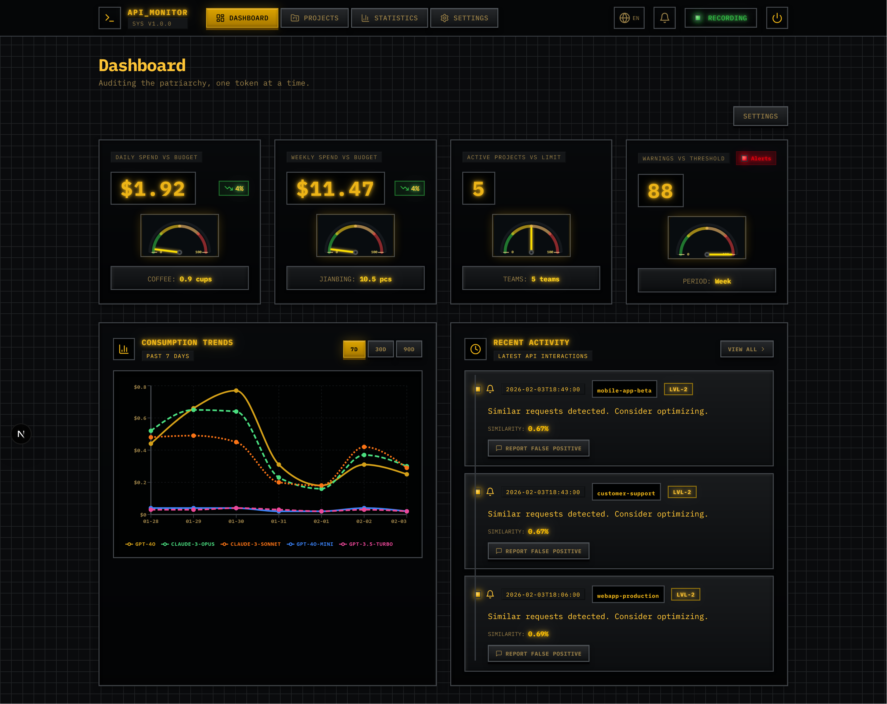
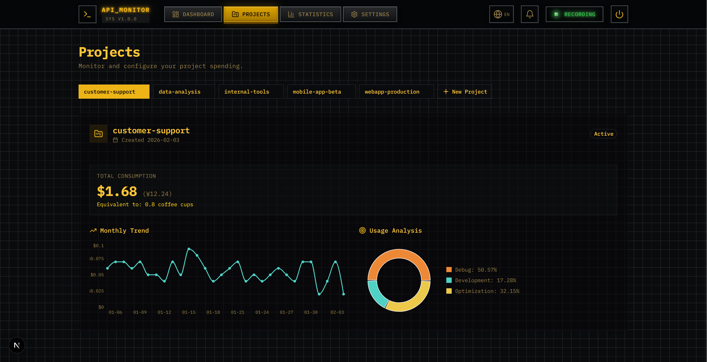
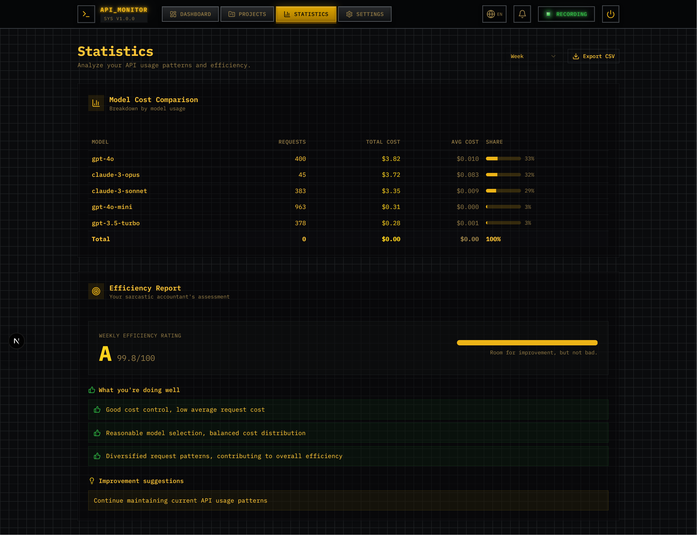
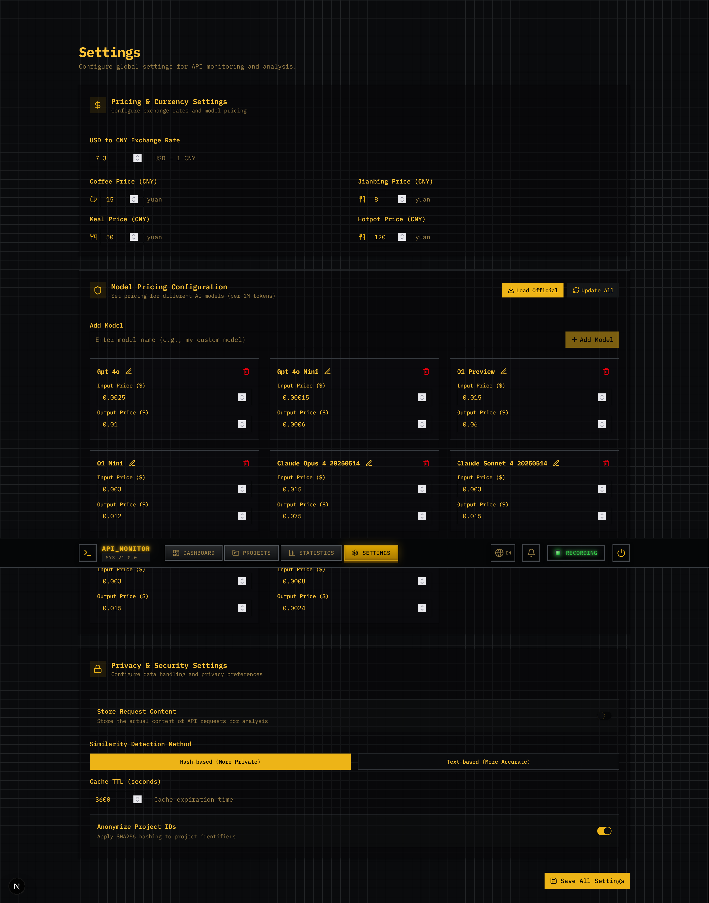

# API Watchdog 🔍💸

> A Smart API Proxy with Personality - Protecting Your Wallet During Debugging Cycles

[](https://opensource.org/licenses/MIT)
[](https://www.python.org/downloads/)
[](https://fastapi.tiangolo.com/)

-----

## What is this?

A **smart LLM API proxy service that actually talks back**. It not only forwards your requests but also:

- 📊 Tracks how much money you're burning (converted to coffee/pancakes)
- 🔄 Detects if you're stuck in "ineffective debugging loops"
- 💬 Reminds you with a witty accountant's tone (sometimes not so gentle)
- 🛑 Forces a 20-minute cooldown when necessary

-----

## Why do you need it?

Have you ever experienced this scenario?

```
You: Help me fix this error
AI: Try modifying it this way
You: Still not working, what should I do?
AI: Try a different approach
You: Still getting errors...
AI: ...
You: (15 minutes later) Why did my bill increase by $5?
```

**This tool is designed to save your wallet.**

-----

## Core Features

### 1️⃣ Smart Proxy

- Supports OpenAI / Anthropic / OpenRouter
- Fully compatible with original API formats
- Seamless streaming response handling

### 2️⃣ Cost Auditing

- Real-time token counting
- Precise cost calculation (down to cents)
- Multi-dimensional currency conversion (USD → CNY → Coffee → Pancakes)

### 3️⃣ Behavior Recognition

- **Similarity Detection**: Identifies repetitive requests (cosine similarity algorithm)
- **Pattern Recognition**: Distinguishes between Debug mode vs Development mode
- **Loop Detection**: 3 consecutive similar requests = Red alert

### 4️⃣ Witty Accountant

Based on your "burn rate", the AI accountant will:

| Level  | Trigger Condition | Response Style                 |
|--------|------------------|-------------------------------|
| Level 0| Normal usage     | Silent                        |
| Level 1| High efficiency  | "Good job, spending wisely ☕" |
| Level 2| Mild repetition  | "Same error again? That's 3 pancakes worth 🥞" |
| Level 3| Serious loop     | "Boss, you're cooking potatoes with GPT-4!" |
| Level 4| Emotional coding | **Forced cooldown** 🛑 Returns 429 |

-----

## Screenshots

<!-- Screenshot placeholder section -->
*Dashboard overview - showing usage statistics and cost analysis*

<!-- Screenshot placeholder section -->
*Project management - project-specific monitoring and detailed analysis*

<!-- Screenshot placeholder section -->
*Statistics page - trend analysis and chart displays*

<!-- Screenshot placeholder section -->
*Settings page - configuration and preferences*

-----

## Quick Start

### 📝 Important Note: Test Data

**This project includes demo test data** for showcasing interface functionality. For actual use, please delete the test data:

```bash
# Delete test data file
rm data/watchdog.db

# Restart service (will create empty database automatically)
docker-compose restart
# or
uvicorn app.main:app --reload
```

### Method 1: Docker (Recommended)

```bash
# 1. Clone the project
git clone https://github.com/Casper-hue/api-watchdog.git
cd api-watchdog

# 2. Configure
cp config.yaml.example config.yaml
# Edit config.yaml with your settings

# 3. Start
docker-compose up -d

# 4. Test
curl -X POST http://localhost:8000/v1/chat/completions \
  -H "Content-Type: application/json" \
  -H "Authorization: Bearer sk-your-openai-key" \
  -d '{"model": "gpt-4o-mini", "messages": [{"role": "user", "content": "Hello"}]}'
```

### Method 2: Python Direct Run

```bash
# 1. Create virtual environment
python -m venv venv
source venv/bin/activate  # Linux/Mac
# or
venv\Scripts\activate     # Windows

# 2. Install dependencies
pip install -r requirements.txt

# 3. Configure
cp config.yaml.example config.yaml
# Edit config.yaml as needed

# 4. Start backend service
uvicorn app.main:app --reload --host 0.0.0.0 --port 8000

# 5. Start frontend (in new terminal)
cd api-watchdog
npm install
npm run dev
```

### Method 3: Development Setup

```bash
# Backend development
cd app
python -m uvicorn main:app --reload

# Frontend development
cd api-watchdog
npm run dev
```

-----

## Configure Your AI Tools

### Cursor Configuration

```json
// settings.json
{
  "cursor.api.baseUrl": "http://localhost:8000/v1",
  "cursor.api.headers": {
    "X-Project-ID": "my-cursor-project"
  }
}
```

### OpenAI SDK Configuration

```python
import openai

openai.api_base = "http://localhost:8000/v1"
openai.api_key = "sk-your-upstream-key"

response = openai.ChatCompletion.create(
    model="gpt-4o",
    messages=[{"role": "user", "content": "Hello"}],
    headers={"X-Project-ID": "my-python-app"}
)

# Check advisor message
advisor_msg = response.response_headers.get('X-Advisor-Message')
if advisor_msg:
    print(f"💬 {advisor_msg}")
```

-----

## Real-World Examples

### Scenario 1: Normal Development

```http
POST /v1/chat/completions
{"model": "gpt-4o", "messages": [...]}

Response:
HTTP/1.1 200 OK
X-Total-Cost-USD: 0.023
X-Total-Cost-CNY: 0.17
X-Advisor-Message: Good job, spending wisely ☕
```

### Scenario 2: Loop Detected

```http
# 1st request
User: "Fix this error in my code"

# 2nd request (82% similarity)
User: "Still not working, fix it"

Response:
HTTP/1.1 200 OK
X-Advisor-Message: Same error again? That's 3 pancakes worth 🥞
X-Advisor-Level: 2
X-Similarity-Score: 0.82
```

### Scenario 3: Forced Cooldown Triggered

```http
# 5 consecutive high-similarity requests, cost $5.23

Response:
HTTP/1.1 429 Too Many Requests
Retry-After: 1200

{
  "error": {
    "message": "Emotional coding detected, take a 20-minute break",
    "details": {
      "cost_usd": 5.23,
      "cost_cny": 38.18,
      "equivalents": {"coffee": 2.5, "hotpot": 0.3},
      "suggestions": ["Go drink some water", "Check the official docs"]
    }
  }
}
```

-----

## Project Structure

```
API-Watchdog/
├── app/                    # Backend FastAPI application
│   ├── main.py            # Main application entry point
│   ├── proxy.py           # API proxy logic
│   ├── analyzer.py        # Behavior analysis logic
│   ├── advisor.py         # Humorous feedback generation
│   ├── models.py          # Database models
│   ├── routes.py          # API routes
│   ├── config.py          # Configuration handling
│   └── i18n.py            # Internationalization
├── api-watchdog/          # Frontend Next.js application
│   ├── app/               # Next.js app router pages
│   ├── components/        # React components
│   ├── lib/               # Utility functions
│   └── public/            # Static assets
├── data/                  # Database files
├── tests/                 # Test files
├── config.yaml            # Main configuration file
├── requirements.txt       # Python dependencies
└── README.md              # This file
```

-----

## Configuration

Key configuration options in `config.yaml`:

```yaml
server:
  host: "0.0.0.0"
  port: 8000

upstream:
  openai:
    base_url: "https://api.openai.com"
  anthropic:
    base_url: "https://api.anthropic.com"

pricing:
  exchange_rate_usd_to_cny: 7.3
  equivalents:
    coffee: 15
    pancakes: 8

analyzer:
  similarity_threshold_warning: 0.65
  similarity_threshold_critical: 0.75
```

-----

## API Usage

### Basic Proxy Usage

```bash
curl -X POST http://localhost:8000/v1/chat/completions \
  -H "Content-Type: application/json" \
  -H "Authorization: Bearer sk-your-key" \
  -H "X-Project-ID: my-project" \
  -d '{
    "model": "gpt-4o-mini",
    "messages": [{"role": "user", "content": "Hello"}],
    "stream": true
  }'
```

### Dashboard API

```bash
# Get dashboard summary
curl http://localhost:8000/api/dashboard/summary

# Get project statistics
curl http://localhost:8000/api/projects/my-project/stats

# Get recent activities
curl http://localhost:8000/api/activities/recent
```

-----

## Features in Detail

### Real-time Cost Tracking
- Monitors token usage across all API calls
- Calculates costs based on current pricing
- Provides cost equivalents (coffee, meals, etc.)

### Intelligent Behavior Analysis
- Uses cosine similarity to detect repetitive patterns
- Identifies debugging vs development patterns
- Provides actionable insights

### Humorous Feedback System
- Multiple levels of feedback based on usage patterns
- Culturally relevant cost comparisons
- Optional rate limiting for excessive usage

-----

## Development

### Prerequisites
- Python 3.11+
- Node.js 18+
- SQLite (included)

### Running Tests

```bash
# Backend tests
cd app
python -m pytest

# Frontend tests
cd api-watchdog
npm test
```

### Building for Production

```bash
# Frontend build
cd api-watchdog
npm run build

# Backend is ready for production
# Use uvicorn with --workers for production
uvicorn app.main:app --workers 4 --host 0.0.0.0 --port 8000
```

-----

## Deployment

### Docker Deployment

```bash
docker-compose -f docker-compose.production.yml up -d
```

### Cloud Deployment

See `DEPLOYMENT_GUIDE.md` for detailed deployment instructions on:
- AWS ECS
- Google Cloud Run
- Vercel (frontend)

-----

## Contributing

We welcome contributions! Please see our contributing guidelines for details.

### Code Style
- Backend: Follow PEP 8 standards
- Frontend: Use TypeScript with strict mode
- Commit messages: Use conventional commits format

### Testing
- Write unit tests for new features
- Ensure all tests pass before submitting PR
- Include integration tests for API endpoints

-----

## Roadmap

- [x] v1.0 - MVP Features
  - [x] Basic proxy functionality
  - [x] Token counting and cost calculation
  - [x] Similarity detection algorithm
  - [x] Humorous message system
- [ ] v1.1 - Multi-Provider Support
  - [ ] Complete Anthropic support
  - [ ] OpenRouter integration
  - [ ] Gemini support
- [ ] v1.2 - Visualization
  - [ ] Web Dashboard
  - [ ] Real-time charts
  - [ ] Historical trend analysis
- [ ] v2.0 - Intelligence
  - [ ] AI-driven model recommendations
  - [ ] Cost prediction
  - [ ] Automatic prompt optimization

-----

## Acknowledgments

Inspired by every developer who spent hours debugging and burning money on API calls (including myself).

Special thanks to:

- [FastAPI](https://fastapi.tiangolo.com/) - Elegant web framework
- [OpenAI](https://openai.com/) - For making this tool necessary

-----

## License

[MIT License](./LICENSE)

-----

**Remember: Use cheaper models for problems you can solve! (Yes, I meant do NOT use Claude Opus for that) 💸**

<p align="center">
  Made with ☕ and 🥞 by developers who are broke
</p>